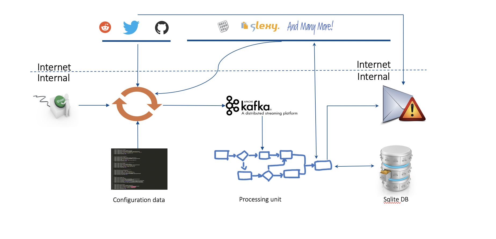

  

 
<h1>Real Time Threat Monitoring Tool</h1>

Monitoring possible threats of your company on Internet is an impossible task to be achieved manually. Hence many threats of the company goes unnoticed until it becomes viral in public. Thus causing monetary/reputation damage. This is where RTTM comes into action.
RTTM (Real Time Threat Monitoring Tool) is a tool developed to scrap all pasties,github,reddit..etc in real time to identify occurrence of search terms configured. Upon match an email will be triggered. Thus allowing company to react in case of leakage of code, any hacks tweeted..etc.. and harden themselves against an attack before it goes viral.

Over the past 2 years the tool has evolved from simple search. Artificial intelligence has been implemented to perform better search based on context. If regex is needed even that is supported. Thus behaviour is close to human and reduces false positives.

<b>The best part of tool  is that alert will be sent to email in less that 60 seconds from the time threat has made it to interent. Thus allowing response in real time to happen..</b>

The same tool in malicious user hands can be used offensively to get update on any latest hacks, code leakage etc..

List of sites which will be monitored are:
<ul>
<li>Non-Pastie Sites</li>
<ul>
<li>Twitter</li>
<li>Reddit</li>
<li>Github</li>
</ul>
<li>Pastie Sites</li>
<ul>
<li>Pastebin.com</li>
<li>Codepad.org</li>
<li>Dumpz.org</li>
<li>Snipplr.com</li>
<li>Paste.org.ru</li>	
<li>Gist.github.com</li>
<li>Pastebin.ca</li>
<li>Kpaste.net</li>
<li>Slexy.org</li>
<li>Ideone.com</li>
<li>Pastebin.fr</li>
</ul>
</ul>

<h2>Architecture:</h2>

<h3>How it works?</h3>
Once the tool is started , engine gets kicked off and it runs forever. The main input for this engine is the configuration file. Based on the configuration file data, engine goes ahead and probes twitter/github/reddit for matches configured in configuration file. Upon a match is found, the link of twitter/github/reddit pushed to sqlite DB and an email alert is triggered.

In case of pastie sites the logic is different. The reason being they do not support search nor streaming api's. Hence any new pastie made by any user, the link is fetched and pushed to kafka. From kafka any new link added is picked up and searched for matches configured in configuration file. Upon a match is found, the link of pastie site is pushed to sqlite DB and an email alert is triggered.

Over the past 2 years the tool has evolved from simple search. Artificial intelligence has been implemented to perform better search based on context. If regex is needed even that is supported. Thus behaviour is close to human and reduces false positives.

<h2>Detailed Tool Documentation:</h2>
https://real-time-threat-monitoring.readthedocs.io/en/latest/

<h2>Developers:</h2>

<b>Authors:</b>
<ul>
<li>Naveen Rudrappa </li>                                                                                               
</ul>

<b>Contributors:</b>
<ul>
<li>Sunny Sharma</li>     
<li>Murali Segu </li>                                                                                           
</ul>

